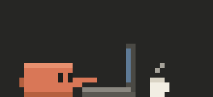
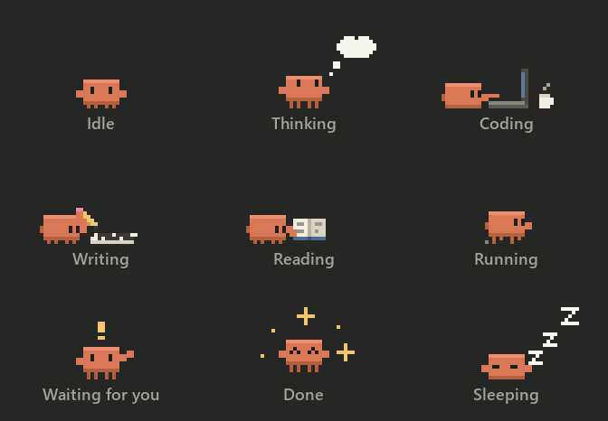

<div align="center">



# claude-cutie

**A tiny pixel-art desktop pet that lives next to Claude Code.**
Clawd the crab reacts in real time to what Claude is doing: thinking, writing code, reading files, running commands.

</div>

---

## Features

- **Live activity.** Claude Code hooks tell Clawd what Claude is doing, as it happens.
- **Nine hand-drawn animations**, all true pixel art on a single grid.
- **Status card.** A dark card above the pet shows your current prompt and what Claude is doing right now, for example *Coding · pet.py…*.
- **Starts with Claude Code.** The pet launches with each session and never opens a second copy.
- **Remembers its spot.** Drag it anywhere and it stays there the next time.
- **Tiny.** One Python file, and Pillow is the only dependency.

<div align="center">

</div>

| Claude is… | Trigger | Clawd… |
|---|---|---|
| **Thinking** | prompt submitted, between tools | looks up, a thought cloud fills with dots |
| **Coding** | `Edit`, `MultiEdit`, `NotebookEdit` | types on a laptop, coffee steaming nearby |
| **Writing** | `Write` | scribbles on a sheet of paper with a pencil |
| **Reading** | `Read`, `Grep`, `Glob`, `WebFetch`, `WebSearch` | reads a book and turns the pages |
| **Running** | `Bash`, `PowerShell`, `Agent` | scuttles back and forth |
| **Waiting for you** | permission prompt or notification | hops and waves, with a golden `!` |
| **Done** | Claude finished its turn | jumps with happy eyes and sparkles |
| **Idle / sleeping** | nothing happening; sleeps after 3 min | breathes, blinks, looks around, then dozes off |

## Installation

Requirements: **Windows**, **Python 3.9+** (with Tk, which the python.org installer includes), and **Claude Code**.

```bash
git clone https://github.com/rsxcore/claude-cutie.git
cd claude-cutie
pip install -r requirements.txt
python install.py
```

Start a new Claude Code session and Clawd shows up in the bottom-right corner.

`install.py` adds a few hooks to `~/.claude/settings.json` and keeps your existing hooks. It saves a backup of the old file as `settings.json.bak`.

## Usage

| Action | Result |
|---|---|
| Drag | move the pet; the position is saved |
| Click | Clawd does a little jump |
| Right-click | preview any animation, or **Quit** |

To start the pet manually, run `pythonw pet.py`.

## How it works

```
Claude Code ──hook──▶ hook.py ──writes──▶ ~/.claude/pet_state.json ──polls──▶ pet.py
```

- **`hook.py`** runs on every hook event. It maps the event or tool to a state and saves it together with the prompt and the file name. On `SessionStart` it also launches the pet if it isn't already running.
- **`pet.py`** is a borderless, always-on-top Tk window with a transparent background. It draws every frame on a 56×26 pixel grid, scales it up with nearest-neighbour, and adds the status card on top.
- **Single instance.** The pet holds a lock on local port `47321`. The hook checks that port before launching the pet.

Files in `~/.claude/`:

| File | Purpose |
|---|---|
| `pet_state.json` | current state, prompt and detail |
| `pet_pos.json` | saved window position |

## Uninstall

```bash
python install.py --uninstall
```

This removes only claude-cutie's hooks. Close the pet from its right-click menu, then delete the folder.

## Customizing

Everything lives in `pet.py`:

- **Palette:** `PAL`
- **Sprites:** `CORE`, `BOOK`, `PENCIL`, `CLOUD` are plain ASCII art, one character per pixel.
- **Scenes:** `Pet.scene()`
- **Timing:** `SLEEP_AFTER`, `DONE_FOR`

To map tools to states, edit `TOOL_STATES` in `hook.py`.

## License

[MIT](LICENSE). Clawd is a fan-made tribute and is not affiliated with Anthropic.
